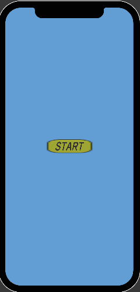
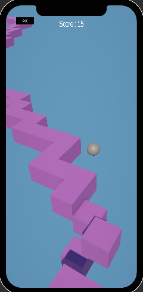
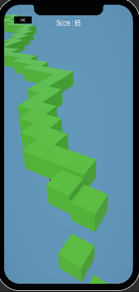

## ZigZag Game 🔴
Unity ile geliştirilmiş, reflekslere dayalı sonsuz bir koşu (infinite runner) oyunu.

## **🕹️ Oyunun Özellikleri**
**Sonsuz Döngü:** Top platformdan düşmediği sürece oyun devam eder.

**Yön Değiştirme:** Ekrana dokunarak veya tıklayarak topun sağa/sola yön değiştirmesi sağlanır.

**Dinamik Renk Değişimi:** Görsel çeşitliliği artırmak için zemin rengi her 3 saniyede bir otomatik olarak değişir.

**Sahne Yönetimi:** Başlangıç ekranındaki Start butonu ile oyun sahnesine geçiş yapılır.
Oyun içindeki sol üst butona basarak ana menüye (başlangıç sahnesine) geri dönülebilir.

## **🛠️ Teknik Detaylar**
Motor: Unity 6 (6000.1.11f1)

Dil: C#

Render Pipeline: URP (Universal Render Pipeline)

Platform: Mobil uyumlu (iOS/Android simülasyonu destekli).

## **📸 Uygulama Ekran Görüntüsü**
  
